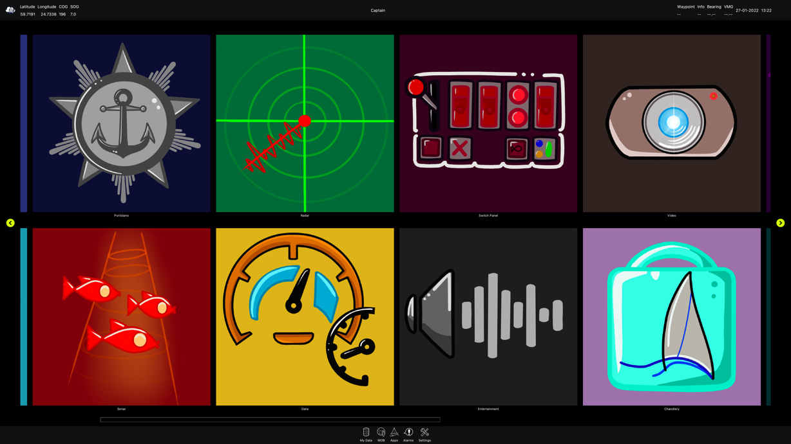
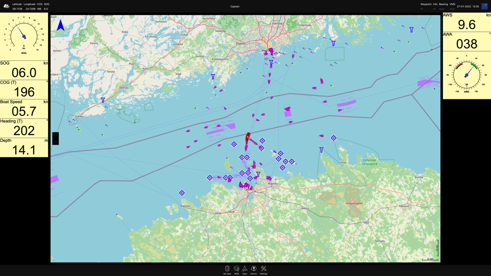
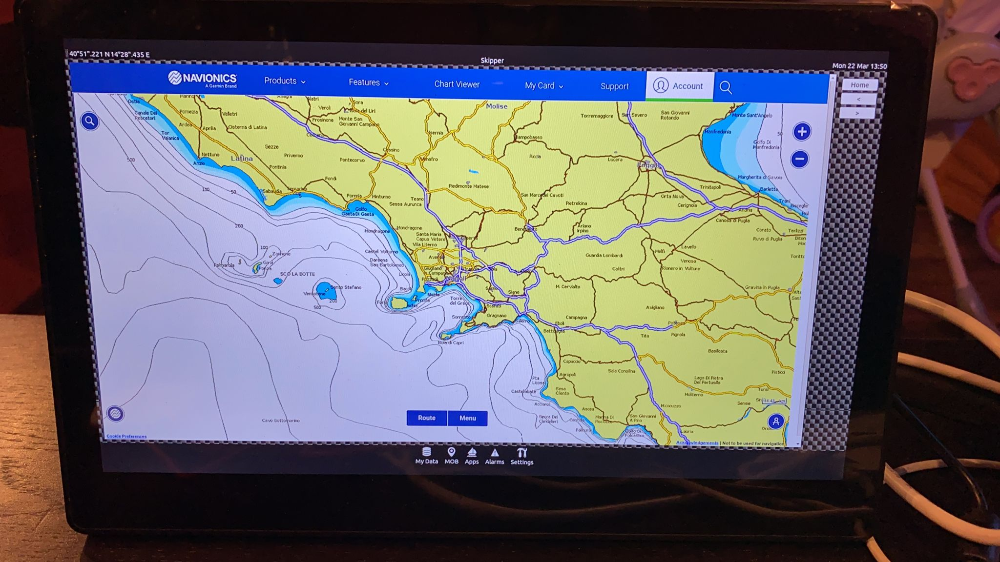
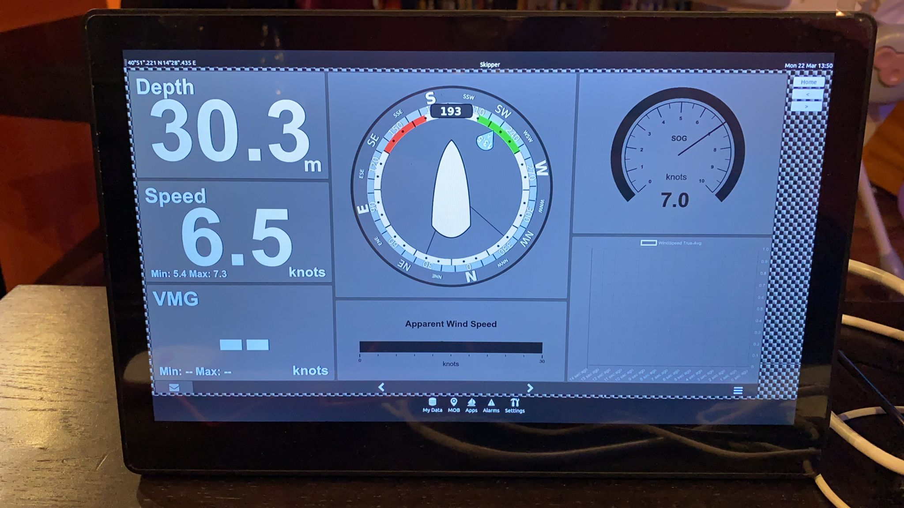

# FairWind++
Integrated multifunctional navigation system based on open technologies.



FairWind++ is a novel execution environment for marine electronics, automotive, and home automation.
It serves as a graphical user interface in the DYNAMO ecosystem.
FairWind++ leverages the [SignalK](http://signalk.org) free and Open Source universal marine data exchange format.

FairWind++ enables third parties in building custom open/closed source apps providing an SDK.

FairWind++ has been tested on Linux (including Raspberry Pi 3b+ and 4), macOS, Windows.
It was developed at the [Department of Science and Technologies](http://dist.uniparthenope.it), [University of Naples "Parthenope"](http://www.uniparthenope.it) within the DYNAMO project with the final goal of providing a citizen science platform for coastal marine data gathering and concentration homogenization and diffusion.
More information [here](http://fairwind.uniparthenope.it).

## FairWind++ Apps
FairWind++ is an execution environment for Apps using the same metaphor of mobile devices
but designed for leisure boats. FairWind++ works on top of an operating system like but is not
limited to Linux, macOS, and Windows.

FairWind++ offers an SDK enabling third parties in App development.
In FairWInd++ can run and co-exist 3 types of Apps:

- **FairWind Apps**

  The FairWind Apps are applications designed to run in the FairWind++ environment.

  The developers built those applications using C++ 17, the FairWind++ SDK, and the QT5.15.2 library.
  The applications can be open or closed-source, tested on a development environment,
  and published on a store.

  The applications similarly work as QT plug-ins to mobile apps.
  Nevertheless, the applications access the onboard sensors, data, and actuators.

  An example of FairWind App the Chart application. 

  

- **Web Apps**

  Web applications are locally hosted or remotely hosted on the internet.

  The Web FairWind App enables the user to create web applications defining a "route" to identify the web app univocally.

  The FairWind app shows the web apps on the launcher as regular applications.

  An example of web application are the
  [Navionics Web App](https://webapp.navionics.com) and the [Signal K](http://signalk.org) Apps.

  

  

- **External Apps**

  External applications are executed by the operating system not explicitly designed to run in the FairWind++ environment.
  The External FairWind app enables the user to define External apps identifying them univocally using a "route".
  Candidate external apps can run in fullscreen non-windowed mode.
  The drawback is that there is no chance to return to the FairWind++ launcher without using a physical key combination or an external device as a sort of "Home button".

  An example of external application is [OpenCPN](https://opencpn.org).

## Building FairWind++
We tested FairWind++ on diverse and different computer architectures and operating system combinations.
FairWind++ is developed in C++ 17 and QT5.12.2.
The following list is an incomplete set of tested working conditions:

- MacOs, Intel
- MacOs, Apple Silicon (the web applications are not working)
- Ubuntu Linux, ARM64
- Ubuntu Linux, X86_64
- Raspberry Pi OS, ARM32
- Windows 10, Intel

### Prerequisites

 - C++ compiler (gcc, CLang)
 - GIT client
 - CMake
 - QT5 version 5.15.2

### Building on Ubuntu Linux

- Download necessary dependencies:
```console
sudo apt-get install build-essential cmake git qtbase5-dev qtchooser qt5-qmake qtbase5-dev-tools qtwebengine5-dev libqt5websockets5-dev qtmultimedia5-dev
```


- In order to build the multimedia components, the gstreamer library is needed:
```console
sudo apt-get install libgstreamer1.0-dev libgstreamer-plugins-base1.0-dev libgstreamer-plugins-bad1.0-dev gstreamer1.0-plugins-base gstreamer1.0-plugins-good gstreamer1.0-plugins-bad gstreamer1.0-plugins-ugly gstreamer1.0-libav gstreamer1.0-doc gstreamer1.0-tools gstreamer1.0-x gstreamer1.0-alsa gstreamer1.0-gl gstreamer1.0-gtk3 gstreamer1.0-qt5 gstreamer1.0-pulseaudio
```

- Clone FairWind's repository:
```console
git clone https://github.com/OpenFairWind/fairwindplusplus.git
```

- Prepare build environment:
```console
cd fairwindplusplus
mkdir build
cd build 
```

- Build:
```console
- cmake -DCMAKE_PREFIX_PATH="/lib/qt5/" ..
make
```

- Launch FairWind++:
```console
./FairWind
```


### Building on Raspberry Pi OS

FairWind++ needs the QT 5.15.2.
Although it is possible to build QT 5.15.2 using the guide here https://www.tal.org/tutorials/building-qt-515-raspberry-pi,
it is warmly suggested to use a clean install of Raspberry Pi Os version 4 or later.
Some apps need QT 5.15.2 MultimediaWidgets and WebEngineWidgets, but those packages are not included in the Rasberry Pi OS version 4.

In order to walkaround this issue, it is possible using Debian Bulleyes packages (https://forums.raspberrypi.com/viewtopic.php?t=325552):

- Login under the pi account.

- Get the Debian key:
```console
wget https://ftp-master.debian.org/keys/archive-key-11.asc
```

- Add the Debian key:
```console
sudo apt-key add Downloads/archive-key-11.asc
```
- Edit the file /etc/apt/sources.list:
```console
sudo nano /etc/apt/sources.list
```
- Add the Trial Debian Repository:
```console
#Trial Debain repo
deb http://deb.debian.org/debian bullseye main contrib non-free
```
- Edit the file /etc/apt/preferences:
```console
sudo nano /etc/apt/preferences
```
- Add the following text:
```console
Package: *
Pin: origin raspbian.raspberrypi.org
Pin-Priority: 800

Package: *
Pin: origin deb.debian.org
Pin-Priority: 600
```
- Update the repository:
```console
sudo apt update
```
- Install the needed packages:
```console
sudo apt-get install cmake libqt5webkit5-dev libqt5virtualkeyboard5-dev libqt5websockets5-dev libqt5widgets5 libqt5multimedia5 libqt5webenginewidgets5 libqt5webkit5-dev libqt5webview5-dev libqt5multimedia5-plugins libqt5webengine5 libqt5webengine-data qtwebengine5-dev qtmultimedia5-dev
```
- Create a development environment:
```console
cd 
mkdir dev
cd dev
```
- Clone the FairWind++ repository:
```console
git clone https://github.com/OpenFairWind/fairwindplusplus.git
```
- Create a build directory:
```console
cd fairwindplusplus
mkdir build
cd buld
```
- Build:
```console
cmake -DCMAKE_PREFIX_PATH="/lib/qt5/" ..
make
```
- Launch FairWind++:
```console
./FairWind
```

### Building on MacOS

***ATTENTION: Qt5 is not yet fully compatible with Apple Silicon SoCs. You can instal qt@5 package but it won't include the qtwebengine widgets, which are necessary to build some FairWind's applications.***

- Install Qt5 from homebrew:
```console
brew install git cmake qt@5
```

- Clone FairWind's repository:
```console
git clone https://github.com/OpenFairWind/fairwindplusplus.git
```

- Prepare build environment:
```console
cd fairwindplusplus
mkdir build
cd build
```

- Build:
```console
cmake -DCMAKE_PREFIX_PATH="/usr/local/opt/qt5/" ..
make
```

- Launch FairWind++:
```console
./FairWind
```

### Building on Windows

- Install the gStreamer library from [this link](https://gstreamer.freedesktop.org/download/). Download the MVSC development installer. After the installation you may have to create the GSTREAMER_1_0_ROOT_MSVC_X86_64 enviroment variable in order to make the library visible to everyone. This variable must have the value of the installation folder of the library (e.g: E:\gstreamer\1.0\msvc_x86_64\). You may have to reboot your computer to apply these changes.

- Install Qt from [this link](https://www.qt.io/download-qt-installer?hsCtaTracking=99d9dd4f-5681-48d2-b096-470725510d34%7C074ddad0-fdef-4e53-8aa8-5e8a876d6ab4). You have to download 5.15.2 version or above. From the installer select the checkbox for installing QtWebEngine. In order to properly install these widgets, you have to choose the MSVC compiler (QtWebEngine is not supported by MinGW compilers).

- Clone FairWind's repository:
```console
git clone https://github.com/OpenFairWind/fairwindplusplus.git
```

- Edit CMakeLists.txt file from the root and uncomment the line #set(CMAKE_PREFIX_PATH "C:\\Qt\\5.15.2\\msvc2019_64\\") and change the CMAKE_PREFIX_PATH variable with the Qt installation folder.

- Prepare the build environment:
```console
cd fairwindplusplus
mkdir build
cd build
```

- Buid:
```console
cmake ..
cmake . --build
```

- Run the executable created.

You can also compile and run it using Qt Creator.
- After the installation of gStreamer, Qt and Qt Creator, create a project by cloning the repository https://github.com/OpenFairWind/fairwindplusplus.git

- Remember to select the MVSC compiler kit

- The CMAKE_PREFIX_PATH variable should be automatically detected, if not, uncomment #set(CMAKE_PREFIX_PATH "C:\\Qt\\5.15.2\\msvc2019_64\\") and set it to the Qt installation folder in CMakeLists.txt file

- In the kit options you can build one library at a time. You have to build QcGaugeWidget, QGeoView and fairwindsdk separately.

- After the build of these 3 libraries you can build and run the entire app with the standard build button of Qt Creator. Make sure every dll and lib file is created for each library (under [your_build_folder]/external/bin and [your_build_folder]/external/lib/static)

- If you have some problem with the ninja build tool, you can skip its step by removing the -GNinja options in the kit options. Remember to delete the build folder in order to reflect this change. 
